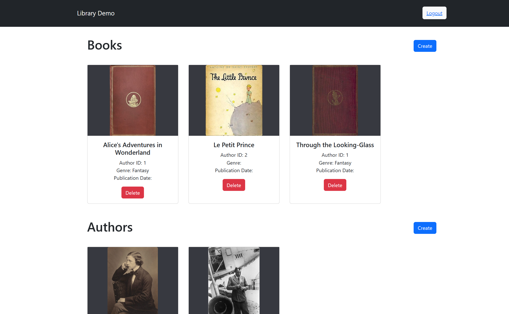
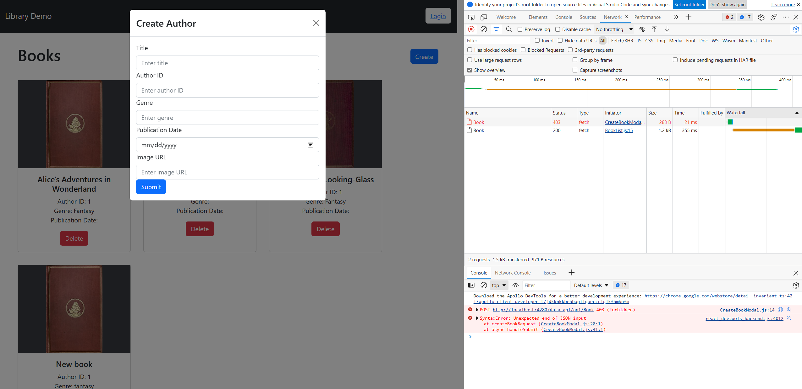
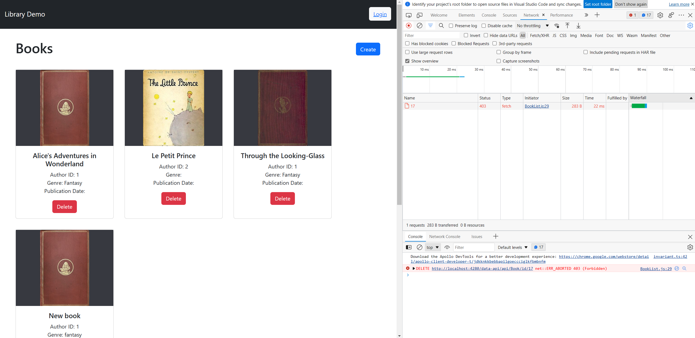
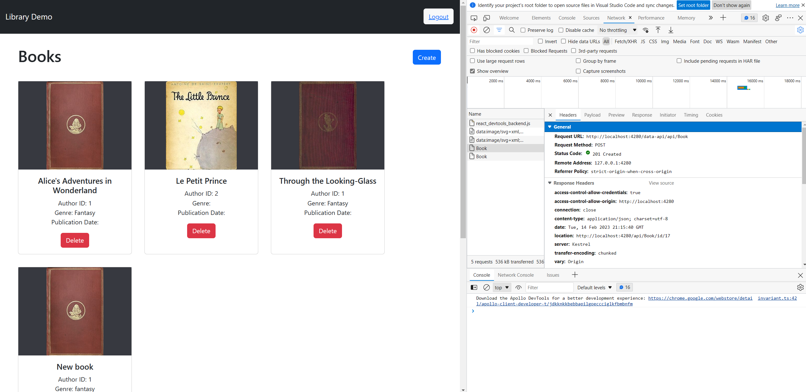

# Library Demo: A sample app of Static Web Apps with Database connections for a React app and Azure SQL database

## Prerequisites
1. An Azure SQL database with the tables created
2. NodeJS
3. An Azure Static Web App resource

## To get started locally
1. Clone this repository
2. Navigate to `library` directory & open with VSCode
3. Set the `DATABASE_CONNECTION_STRING` environment variable to your connection string in your terminal/cmd/powershell. Alternatively, paste your database connection string directly into `swa-db-connections/staticwebapp.database.config.json` (*not recommended*) (ensure that you remove this secret from your source code before pushing to GitHub/remote repository)
4. Run `swa start http://localhost:3000 --run "cd library-demo && npm i && npm start" --api-location api --data-api-location swa-db-connections`
    * `cd library-demo && npm i && npm start` will install needed npm packages and run your React app
    * `--api-location api` indicates to the SWA CLI to run your `api` folder as a managed function app
    * `--data-api-location swa-db-connections` indicates to the SWA CLI that your database connections configurations are in the `swa-db-connections` folder
Alternatively, you can start all these projects manually an make use of SWA CLI's other args

You can now use your Static Web App Library Demo Application. It supports authorization, such that anyone logged in with SWA CLI's authentication emulation with the `admin` role will have `CRUD` access, while anonymous users are limited to `read` access. See the configurations detailed in `staticwebapp.database.config.json`

## To deploy
1. Commit all your changes and push to your repository. 
    * You do not need to change your configuration file's `data-source` object, since this will be overwritten by your Static Web App resource when you connect a database.
    * (If you have paste your connection string directly in your configuration file, ensure that you remove it to avoid making your database connection string public)
2. Go to your Static Web App resource in the portal. Go to the Database connection tab.
3. Ensure that your database is ready for connection. It should be configured to accept network requests from Azure services. If you plan to use managed identity as a connection type, ensure that you've configured the managed identity within your database. 
4. Link your database to your default environment. Select your database & enter the credentials.

## Troubleshooting
* Ensure your Azure database is configured to accept network requests
* Ensure that your configuration files have been placed in your repository and included in your build process. 
* Ensure that your managed identity has been configured within your database.

## Screenshots

### Home page:

### Non-logged in users receive 403's when they try to Create as configured in `swa-db-connections/staticwebapp.database.config.json`

### Non-logged in users receive 403's when they try to Delete as configured in `swa-db-connections/staticwebapp.database.config.json`

### Log in page with `admin` role

### Non-logged in users receive succesful 201's when they try to Create as configured in `swa-db-connections/staticwebapp.database.config.json`
